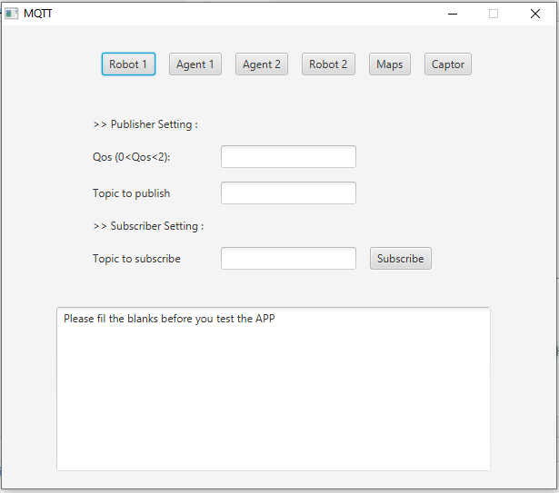

# MQTT_JAVA
## Simple desktop app built with javaFX.

Note:This project is built in order to simulate a smart house with Real-Time communication using MQTT.

### What to do ?
1.Donwnload the code.

2.Open your IDE and load the project.

3.Install javaFX because JDK doesn't come with it.

4.Add the jar file to your project, you will find it in the src folder inside the jar file folder.

5.Run local.java

